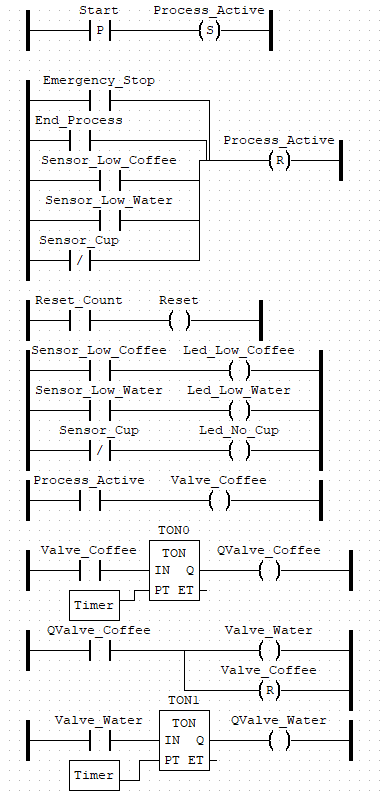
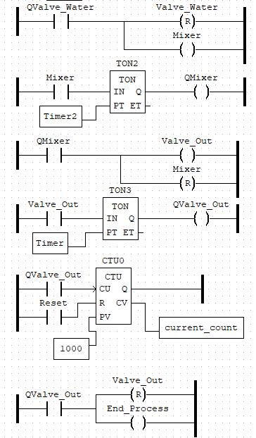

# Parcial-2-Wiki

##Diseño


##Desarrollo de la implementación

Ahora se hablará de la implementación de la solución de CODESYS en el programa OPENPLC.

En este programa se implementó la simulación más cercana que se puede a lo que se espera que suceda en el mundo real, es por esta razón que se buscó diseñar el programa de tal forma que ya tuviera todas las implementaciones físicas que son particulares de la solución, es decir, lo ya mencionado anteriormente como lo son sensores, sensor infrarrojo, entre otros componentes. Esto mediante principalmente de la capacidad de integrar código en C++ con la programación Ladder del programa OPENCL, de esta manera, se implementó código buscando el funcionamiento adecuado del proceso implementado, el ejemplo más claro de este diseño fue la implementación de código para poder mostrar el dato de la cantidad de cafés servidos en un Display LCD, el cual necesita de una configuración en código para poder funcionar de manera adecuada. Este código se documenta a continuación:

```c++
#include <LiquidCrystal_I2C.h>  // if you don\xb4t have I2C version of the display,
                                // use LiquidCrystal.h library instead

LiquidCrystal_I2C lcd(0x27,16,2);  // set the LCD address to 0x27
                                   // if you don\xb4t know the I2C address of the 
                                   // display, use I2C scanner first 
                                   //(https://playground.arduino.cc/Main/
                                   // I2cScanner/)


// define custom characters/arrays - every character is 5x8 "pixels"

byte gauge_empty[8] =  {B11111, B00000, B00000, B00000, B00000, B00000, B00000, B11111};    // empty middle piece
byte gauge_fill_1[8] = {B11111, B10000, B10000, B10000, B10000, B10000, B10000, B11111};    // filled gauge - 1 column
byte gauge_fill_2[8] = {B11111, B11000, B11000, B11000, B11000, B11000, B11000, B11111};    // filled gauge - 2 columns
byte gauge_fill_3[8] = {B11111, B11100, B11100, B11100, B11100, B11100, B11100, B11111};    // filled gauge - 3 columns
byte gauge_fill_4[8] = {B11111, B11110, B11110, B11110, B11110, B11110, B11110, B11111};    // filled gauge - 4 columns
byte gauge_fill_5[8] = {B11111, B11111, B11111, B11111, B11111, B11111, B11111, B11111};    // filled gauge - 5 columns
byte gauge_left[8] =   {B11111, B10000, B10000, B10000, B10000, B10000, B10000, B11111};    // left part of gauge - empty
byte gauge_right[8] =  {B11111, B00001, B00001, B00001, B00001, B00001, B00001, B11111};    // right part of gauge - empty

byte gauge_mask_left[8] = {B01111, B11111, B11111, B11111, B11111, B11111, B11111, B01111};  // mask for rounded corners for leftmost character
byte gauge_mask_right[8] = {B11110, B11111, B11111, B11111, B11111, B11111, B11111, B11110}; // mask for rounded corners for rightmost character

byte warning_icon[8] = {B00100, B00100, B01110, B01010, B11011, B11111, B11011, B11111};     // warning icon - just because we still have one custom character left

byte gauge_left_dynamic[8];
byte gauge_right_dynamic[8];

char buffer[10];
int move_offset = 0;
const int gauge_size_chars = 16;
char gauge_string[gauge_size_chars+1];

void sketch_setup()
{
    lcd.init();                       // initialize the 16x2 lcd module
    lcd.createChar(7, gauge_empty);   // middle empty gauge
    lcd.createChar(1, gauge_fill_1);  // filled gauge - 1 column
    lcd.createChar(2, gauge_fill_2);  // filled gauge - 2 columns
    lcd.createChar(3, gauge_fill_3);  // filled gauge - 3 columns
    lcd.createChar(4, gauge_fill_4);  // filled gauge - 4 columns  
    lcd.createChar(0, warning_icon);  // warning icon - just because we can
    lcd.backlight();                  // enable backlight for the LCD module
}

void sketch_loop()
{
    float units_per_pixel = (gauge_size_chars*5.0)/100.0;
    int value_in_pixels = round(current_count * units_per_pixel);

    int tip_position = 0;

    if (value_in_pixels < 5) 
    {
        tip_position = 1;
    }
    else if (value_in_pixels > gauge_size_chars*5.0-5) 
    {
        tip_position = 3;
    }
    else 
    {
        tip_position = 2;
    }

    move_offset = 4 - ((value_in_pixels-1) % 5);

    for (int i=0; i<8; i++) 
    {
        if (tip_position == 1) 
        {
            gauge_left_dynamic[i] = (gauge_fill_5[i] << move_offset) | gauge_left[i];
        }
        else 
        {
            gauge_left_dynamic[i] = gauge_fill_5[i];
        }

        gauge_left_dynamic[i] = gauge_left_dynamic[i] & gauge_mask_left[i];
    }

    for (int i=0; i<8; i++) 
    {
        if (tip_position == 3) 
        {
            gauge_right_dynamic[i] = (gauge_fill_5[i] << move_offset) | gauge_right[i];
        }
        else 
        {
            gauge_right_dynamic[i] = gauge_right[i];
        }

        gauge_right_dynamic[i] = gauge_right_dynamic[i] & gauge_mask_right[i];
    }  

    lcd.createChar(5, gauge_left_dynamic);
    lcd.createChar(6, gauge_right_dynamic);

    for (int i=0; i<gauge_size_chars; i++) 
    {
        if (i==0) 
        {
            gauge_string[i] = byte(5);
        }
        else if (i==gauge_size_chars-1) 
        {
            gauge_string[i] = byte(6);
        }
        else 
        {
            if (value_in_pixels <= i*5) 
            {
                gauge_string[i] = byte(7);
            }

            else if (value_in_pixels > i*5 && value_in_pixels < (i+1)*5) 
            {
                gauge_string[i] = byte(5-move_offset);
            }
            else 
            {
                gauge_string[i] = byte(255);
            }
        }
    }    

    // gauge drawing
    lcd.setCursor(0,0);              // move cursor to top left
    sprintf(buffer, "CTU:%3d%% ", current_count);
    lcd.print(buffer);               // print the string on the display
    lcd.write(byte(0));              // print warning character  
  
    lcd.setCursor(0,1);              // move the cursor to the next line
    lcd.print(gauge_string);         // display the gauge
}
```
*Tomado de los ejemplos dados por OPENPLC

Además de este caso donde se necesita usar código, el diseño es básicamente el mismo que se puede observar en CODESYS, utilizando el mismo tipo de programación visual, basada en contactos y bobinas, y también agregando los bloques de funciones estándar como lo son los TON, y el CTU utilizados en el desarrollo del proceso, ahora, se demostraran las variables de entrada y salida que se usaron para crear el proceso dentro del programa:


Luego de tener definidas estas variables, y como se puede observar en la imagen, se le asigno un valor para su ubicación lógica en OPENPLC, lo que significa que esa variable tiene un valor especifico en los pines del Arduino al momento de programar el Arduino con este programa creado, de igual manera, se puede observar a que pin físico corresponde cada entrada o salida de este proceso. 

Despues de haber definido estas variables principales se continuo realizando el resto de la programación del proceso en logica ladder, como ya se habia comentado en la seccion de CODESYS, para finalmente dar con la arquitectura presentada a continuacion, la cual ya tiene incluido los sensores y el codigo especial que se usara para el Display LCD.




##Validación de funcionamiento
