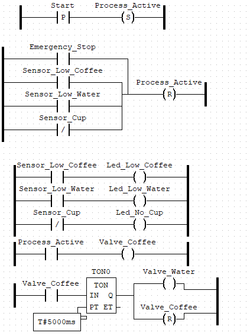

# Parcial-2-Wiki

## Introducción
El presente proyecto tiene como objetivo automatizar el proceso de preparación de café en máquinas dispensadoras industriales, actualmente operadas de manera manual por la empresa Café & Máquinas S.A. Esta automatización busca mejorar la eficiencia operativa, garantizar un control preciso del inventario y permitir una experiencia más segura y confiable para el usuario final.

Para ello, se diseñó e implementó un sistema automático basado en tecnologías de control industrial, utilizando PLC y sensores, junto con una interfaz gráfica HMI desarrollada en CODESYS. El proceso fue validado a través de simulación por tiempo y a traves de sensores el cual fue programado en OpenPLC, que responde a eventos reales mediante sensores conectados a entradas digitales. 

## Levantamiento de requerimientos
Para el desarrollo de este proyecto, basados en el enunciado por el profesor, se levantan los siguientes items.  

**Requisitos funcionales:**
* Automizar el proceso de preparación de café, eliminando la necesiadad de poner el cafe y el agua en cada ciclo.
* Interfaz HMI para iniciar/parar el proceso.
* Sensores de nivel de café y agua.
* Sensores de presencia de vaso.
* Contabilización de vasos dispensados.
* Validación con prototipo físico utilizando OpenPLC.  

**Requisitos no funcionales:**
* Simulación en CODESYS.
* Validación del prototipo físico.

## Diseño de las solución

## Desarrollo de la implementación

### Programación en CODESYS:
En la documentación del Codesys se explica cada una de las redes creadas y las variables utilizadas, este enfoque se centra en una aproximación de proceso controlado por tiempo.

### Programación en OPENPLC:
En este programa se implementó la simulación más cercana que se puede a lo que se espera que suceda en el mundo real, es por esta razón que se buscó diseñar el programa de tal forma que ya tuviera todas las implementaciones físicas que son particulares de la solución, es decir, lo ya mencionado anteriormente como lo son sensores, sensor infrarrojo, entre otros componentes. Esto mediante principalmente de la capacidad de integrar código en C++ con la programación Ladder del programa OPENCL, de esta manera, se implementó código buscando el funcionamiento adecuado del proceso implementado, el ejemplo más claro de este diseño fue la implementación de código para poder mostrar el dato de la cantidad de cafés servidos en un Display LCD, el cual necesita de una configuración en código para poder funcionar de manera adecuada. Este código se aplico y se trato de aplicar, sin embargo, debido a un mal funcionamiento con las librerias que se trataron de implementar. Entonces para este punto se dejo una salida simple, donde se buscara colocar un led que indique cada vez que llegue una nueva señal indicando que se conto un cafe nuevo.

Además de este caso donde se necesita usar código, el diseño es básicamente el mismo que se puede observar en CODESYS, utilizando el mismo tipo de programación visual, basada en contactos y bobinas, y también agregando los bloques de funciones estándar como lo son los TON, y el CTU utilizados en el desarrollo del proceso, ahora, se demostraran las variables de entrada y salida que se usaron para crear el proceso dentro del programa:

Luego de tener definidas estas variables, y como se puede observar en la imagen, se le asigno un valor para su ubicación lógica en OPENPLC, lo que significa que esa variable tiene un valor especifico en los pines del Arduino al momento de programar el Arduino con este programa creado, de igual manera, se puede observar a que pin físico corresponde cada entrada o salida de este proceso. 

Despues de haber definido estas variables principales se continuo realizando el resto de la programación del proceso en logica ladder, como ya se habia comentado en la seccion de CODESYS, para finalmente dar con la arquitectura presentada a continuacion, la cual ya tiene incluido los timers que se usarán y de igual manera el contador encargado de .

## Validación de funcionamiento

Como primer acercamiento a validar el correcto funcionamiento del programa, usando OPENPLC, se comenzaron a hacer pruebas de simulación desde la visualización, ya que se quería comprobar que lo implementado en CODESYS funcionará de manera correcta. Esta simulación cumple un papel fundamental en el proceso de diseño ingenieril, ya que permite evaluar el comportamiento de cada etapa del proceso bajo condiciones controladas, sin necesidad de contar inicialmente con todos los componentes físicos. Para esto se utilizaron botones y leds que utilizaban las variables que ya habiamos asignado, además de negar algunas para poder utilizarlo con función de invisible, que lo mantiene mientras este en TRUE.

En esta simulación se plantea que la tapa delantera se active o desactive para poder ver el proceso con la logica por dentro, en este caso la variable Process_Active es la que se usa ya que mientras el proceso este activo, hace invisible. 

     
 

El HMI nos peermite ver las distintas fases del proyecto, y como se comporta ante situaciones criticas como la auscencia de agua o cafe, o si la tasa no esta como se comporta, todos los estados que se plantean en el diagrama secuencial. Para la animación confirmamos que las valvulas de salida debia eventualmente apagarse y ya que teniamos un contador con PV 1, y ahí se quedaba.

En las primeras pruebas, aun sin usar el código para convertir la señal de la salida del contador a algo entendible por el Display LCD, se encontró un error en la programación, el cual consiste en el pin "PV" del CTU, ya que originalmente se tenía un valor de 1, para que el CTU lo contara como satisfactorio y avanzara con la lógica, para así poder activar el reinicio de "Valve_Out", sin embargo, esta disposición no lograba permitir que el CTU contara más allá de 1, por lo cual se decidió por dar un valor más alto, casi imposible para una cafetera de este tipo, para así evitar el problema ya mencionado, el valor elegido fue 1000.

Otra de las validaciones que se realizaron y produjeron cambios en la forma en la que se simulaba el proceso, sucedió cuando al simular, se hizo evidente que la variable "Sensor_Cup" iniciaba con un valor de "True" lo cual no permitía iniciar el proceso debido a la lógica de programación Ladder que se siguió, ya que esta variable es de naturaleza cerrada, por lo cual, se tuvo que hacer necesario que cada vez que se iniciara una simulación se forzara el estado en falso de esa variable.

También cabe destacar, que las primeras veces simulo el proceso después de haber implementado el código en C++ para el funcionamiento de un Display LCD externo para reportar el conteo de días, este código, alojado en su archivo separado de texto se borraba cada vez que se simulaba, o se sale del programa, esta complicación después dejo de presentarse cuando se dejo el comentario incial con el que cuenta ese archivo, sin embargo, este arreglo no sirvio de mucho, porque como ya se menciono antes, el Display LCD se decidio por no colocar en el montaje final, ya que se presenta un problema con la libreria a importar, el cual no se pudo corregir para un funcionamiento satisfactorio. 

Frente a la implementación fisica del sistema y su montaje, se encontraron bastantes dificultades a la hora de intentar implementarlo, en primera instancia a la hora de intentra pasar la implementación del OpenPLC al Arduino nos encontramos con problemas de peso del archivo, siguiendo con las limitaciones que se dieron, en el momento en donde el codigo estaba completamente funcional para poderlo implementar de manera fisica, el programa OpenPLC daba un error de sincronización el cual no permitió la correcta implementación del sistema y funcionamiento fisico, frente al montaje se iba a utilizar un sensor infrarojo para la detección del vaso y para determinar la capacidad la cual los contenedores se iba a utilizar dos sensores de ultrasónicos donde si la cantidad del liquido simulado (Ya fuese cafe o agua) tuviese un bajo nivel o un nivel nulo, no permitiera el funcionamiento de la cafetera, esto para que no ocurra que se entrege un vaso con solamente la mitad del producto y se cuente como finalizado, siendo asi, una vez los dos ingredientes pasaran al contenedor de mezcla, un motor se encargaría de mezclar el "café" con el agua para finalmente servir el producto, para aclarar el pasode los liquidos entre contenedores, se iba a usar una bomba de agua la cual se encargaría del flujo de los liquidos. Por otro lado, con un sensor infrarojo se tuvo en cuenta una alerta si efectivamente se encontraba en el espacio determinado un vaso para depositar el producto. Finalizando, se iba a tener en cuenta un display el cual mostraría la cantidad de vasos servidos hasta que se vuelva a reiniciar el contador dado que el dueño de la tienda inicie nueva semana o nuevo mes y requiera de iniciar desde 0 y realizar un analisis diferente.

## Roles, Actividades y Contribuciones de los Miembros del Equipo

A continuación, se detallan los roles, actividades desarrolladas y principales contribuciones de cada uno de los integrantes del equipo en la solución alcanzada:

---

### 👤 Juan Manuel Deutsch Torrado  
**Rol:** Desarrollador principal y Diseñador de maqueta   
**Actividades:**  
- Diseño y desarrollo de la maqueta.  
- Revisión del funcionamiento en Codesys.  
- Planteamiento de diagramas secuenciales.  
- Pruebas de funcionamiento y verificación del sistema integrado.
  
**Contribuciones:**  
- Detectó un error en el planteamiento de los contadores, lo que permitió desbloquear un punto crítico del desarrollo.  
- Validó el funcionamiento correcto del sistema tras la integración de los módulos.

---

### 👤 Gabriel David Jiménez Mosquera  
**Rol:** Documentador técnico y Desarrollador principal   
**Actividades:**  
- Diseño e implementación del sistema en OpenPLC.  
- Manejo y configuración del Arduino Uno.  
- Redacción y mantenimiento de la documentación técnica en el Wiki.  
  
**Contribuciones:**  
- Optimizó el código para su correcta carga en el Arduino Uno.  
- Propuso una lógica en OpenPLC sin timers, mejorando la eficiencia del sistema.  
- Mantuvo actualizada la documentación, facilitando la comprensión del proyecto por parte del equipo.

---

### 👤 César Felipe Giraldo Mora  
**Rol:** Líder del proyecto y Desarrollador principal    
**Actividades:**  
- Traducción de los requerimientos funcionales a una solución de ingeniería.  
- Diseño y desarrollo del diagrama Ladder en Codesys y simulación del HMI.  
- Documentación técnica en el Wiki.  
  
**Contribuciones:**  
- Estableció la lógica inicial del sistema y realizó el debug del Ladder.  
- Integró la solución en Codesys y ajustó los parámetros necesarios para la simulación.

---

